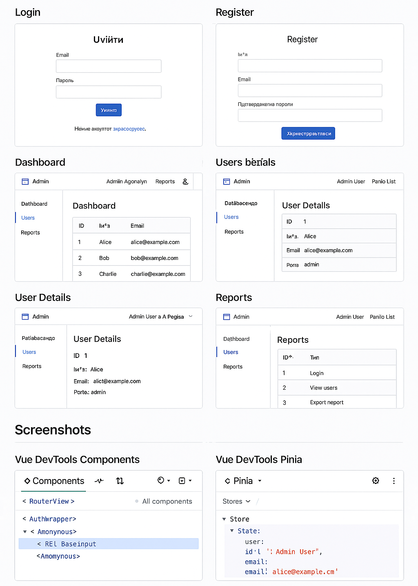

# Лабораторна робота №2
## Взаємодія між компонентами та роутинг у Vue 3


---

## 📌 Мета роботи
- Засвоїти механізми взаємодії між компонентами у Vue 3:  
  **props**, **emits**, **v-model / defineModel**, **provide/inject**, **слоти**.
- Навчитися працювати з Vue Router 4:  
  **маршрути**, **lazy-loading**, **named views**, **meta-поля**,  
  **глобальні guard’и**, **scrollBehavior**.
- Реалізувати приклад міні-адмінки з імітованою автентифікацією.
- Використати `<KeepAlive>` для кешування підвкладок Dashboard.

---

## 🚀 Запуск проєкту

```bash
npm install
npm run dev
```

Сервер відкриється за адресою:  
👉 http://localhost:5173/

---

## 📁 Основні можливості застосунку

### 🔐 Автентифікація (імітація)
Реалізовано просту авторизацію на основі Pinia Store:

- **Login:** email, password
- **Register:** name, email, password, confirmPassword
- Валідація форм
- Авторизація зберігається в памʼяті
- Несанкціонований доступ до `/admin/...` перенаправляється на `/login`

---

## 🛣 Маршрути (Vue Router 4)

Маршрути згідно умови:

| Маршрут | Доступ | Опис |
|--------|--------|-------|
| `/` | public | Головна |
| `/login` | public | Вхід |
| `/register` | public | Реєстрація |
| `/admin` | requiresAuth | Батьківський маршрут адмінки |
| `/admin/dashboard` | requiresAuth | Dashboard із вкладками та KeepAlive |
| `/admin/users` | requiresAuth | Список користувачів |
| `/admin/user/:id` | requiresAuth | Інформація про користувача |
| `/admin/reports` | requiresAuth | Reports зі scoped-slot |
| `/:pathMatch(.*)*` | public | 404 Not Found |

### Додаткові можливості:
- **createWebHistory()**
- **scrollBehavior (top = 0)**
- **linkActiveClass = "active-link"**
- **beforeEach guard**
- **lazy-loading компонентів**
- **named views** (toolbar)

---

## 🧩 Взаємодія між компонентами

### ✔ props / emits
Використано у таблиці користувачів:

```
UsersTable.vue → Users.vue
```

- `props`: список користувачів
- `emits`: подія вибору користувача

---

### ✔ v-model / defineModel
У `BaseInput.vue` використано:

```js
const model = defineModel()
```

---

### ✔ provide / inject
У `AdminLayout.vue`:

```js
provide("currentUser", auth.user)
```

У дочірніх компонентах:

```js
inject("currentUser")
```

---

### ✔ Слоти
1. **AuthWrapper.vue** — слот заголовка та контенту
2. **AdminLayout.vue** — слот для Sidebar
3. **Reports.vue** — scoped-slot `#row="{ item }"`

---

## 🧠 KeepAlive

У Dashboard:

- Вкладки: **Overview** та **Activity**
- Кешування Overview
- Activity не кешується

```vue
<KeepAlive :include="['OverviewTab']"
           :exclude="['ActivityTab']"
           :max="1">
```

---

## 🧰 Lazy-loading

```js
const Dashboard = () => import('@/views/admin/Dashboard.vue')
```

---

## 🧱 Named Views

```js
components: {
  default: Dashboard,
  toolbar: AdminToolbar
}
```

---

## 📊 Scoped Slot у Reports

```vue
<template #row="{ item }">
  <td>#{{ item.id }}</td>
  <td><strong>{{ item.type }}</strong></td>
  <td>{{ item.date }}</td>
</template>
```

---

## 💾 Технології

- Vue 3 + Composition API
- Vite
- Vue Router 4
- Pinia
- defineModel
- provide/inject
- Lazy-loading
- KeepAlive
- Scoped Slots
---

## 📸 Скриншоти 



---

## ✔ Висновки

У ході виконання роботи було:

- Реалізовано клієнтську міні-адмінку з авторизацією
- Налаштовано Vue Router з guard’ами, meta та lazy-loading
- Виконано взаємодію між компонентами: props, emits, provide/inject
- Використано scoped slots, KeepAlive та named views
