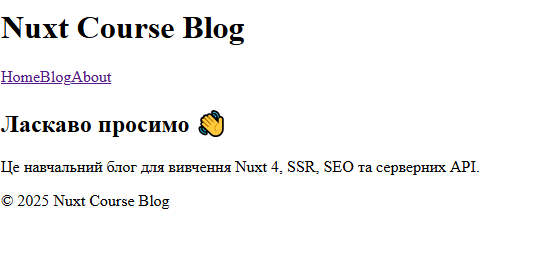
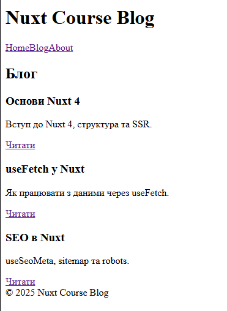
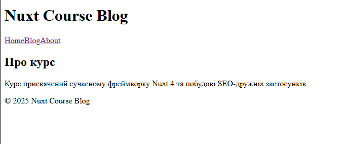

# Лабораторна робота №6
## Розробка вебзастосунку з використанням Nuxt 4 та Nitro API


---

## 📌 Мета роботи
Ознайомитися з фреймворком **Nuxt 4** та закріпити навички:
- створення SSR/SPA-застосунків;
- роботи з файловою маршрутизацією;
- використання серверних API (**Nitro**);
- отримання даних через `useFetch`;
- SEO-оптимізації сторінок;
- генерації `sitemap.xml` та `robots.txt`;
- використання UI-бібліотеки **Nuxt UI**.

---

## 🚀 Запуск проєкту

```bash
npm install
npm run dev
```

Після запуску застосунок буде доступний за адресою:  
👉 **http://localhost:3000**

---

## 🧰 Використані технології

- Nuxt 4
- Vue 3
- Nitro API
- useFetch
- Nuxt UI
- TypeScript
- @nuxtjs/sitemap
- @nuxtjs/robots

---

## 🗂 Сторінки застосунку

- `/` — головна сторінка
- `/blog` — список статей
- `/blog/[slug]` — окрема стаття
- `/about` — сторінка “Про курс”

---

## 🧩 Layout та UI

- використано `layouts/default.vue`;
- `<NuxtPage />` підключено в `app.vue`;
- навігація через `NuxtLink`;
- UI-компоненти: `UContainer`, `UCard`, `UButton`, `UAlert`.

---

## 🌐 Серверна частина (Nitro)

Реалізовано API:
- `GET /api/posts`
- `GET /api/posts/[slug]`
- `GET /api/__sitemap__/urls`

---

## 🔄 Отримання даних

- використано `useFetch`;
- обробка `pending` та `error`.

---

## 🔍 SEO

- `useSeoMeta` для title та description;
- `sitemap.xml` доступний за `/sitemap.xml`;
- `robots.txt` доступний за `/robots.txt`.

---

## 📸 Скриншоти






---

## ✔ Висновки

У ході виконання лабораторної роботи я створив навчальний блог на Nuxt 4 з серверними API, SEO-оптимізацією та сучасним UI.

